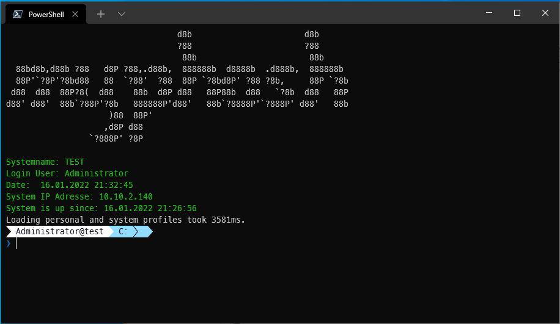

# myPosh

myPosh is primarily intended to improve the look and usability of Powershell.
In addition, various functions are added to facilitate various tasks.


## Installation
For installation, please download and unzip the current version. HERE

Then start the Powershell as admin and navigate to the unzipped directory.

Then start the installation file:

```powershell
  .\install.ps1
```


## Features

- Windows Terminal Configuration
- Customization of Powershell layout
- Functions:
  - Start-asAdmin
  - Start-PSasAdmin


## Screenshots




## Acknowledgements

 - [FAQ](https://github.com/nox309/myPosh/tree/master/doc/FAQ.md)
 - [External Sources](https://github.com/nox309/myPosh/blob/master/doc/extSources.md)
